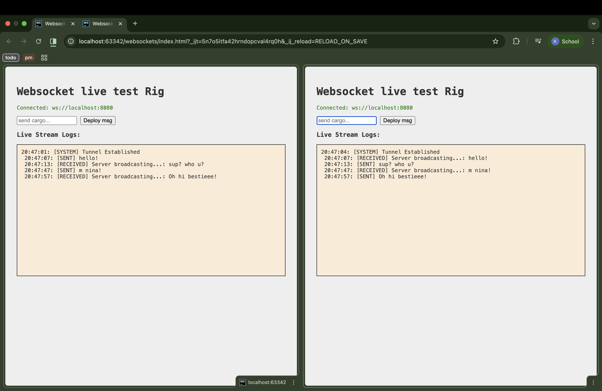
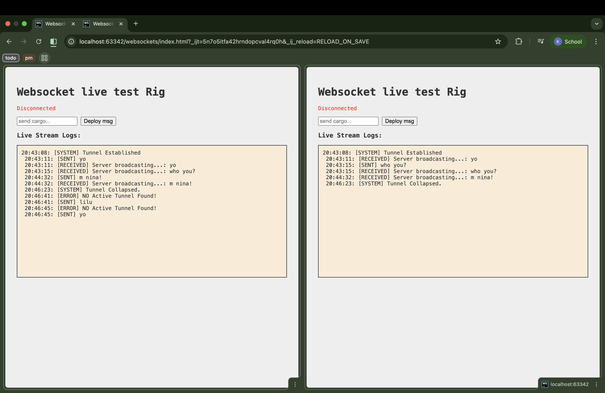

# WebSocket Live Test Rig 🚀

A lightweight, real-time communication platform built with **Node.js** and **WebSockets**. This project demonstrates the core mechanics of the WebSocket protocol, including the initial HTTP handshake and full-duplex broadcasting with sender exclusion logic.

***

## 📸 Demo

| Initial Connection | Live Broadcast |
| :---: | :---: |
|  |  |

***

## ✨ Core Features

* **Real-time Broadcasting:** Messages sent by one client are immediately relayed to all other connected peers.
* **Sender Exclusion:** Implemented server-side logic to ensure the sender does not receive an "echo" of their own message.
* **Handshake Automation:** The server automatically manages the "Upgrade" header process from HTTP to WS.
* **Live Stream Logs:** Detailed frontend logging with timestamps and status labels (`[SYSTEM]`, `[SENT]`, `[RECEIVED]`).

***

## 🛠️ Technical Stack

* **Frontend:** Vanilla HTML5, CSS3, and JavaScript (WebSocket API).
* **Backend:** Node.js with the `ws` library.
* **Protocol:** Full-duplex WebSocket (ws://).

***

## 🚀 Getting Started

### 1. Prerequisites
Ensure you have [Node.js](https://nodejs.org/) installed on your machine.

### 2. Installation
Clone the repository and install the necessary peer dependencies:
```bash
npm install ws
```

### 3. Running the Server
   Start the WebSocket server on port 8080:
```Bash
node server.js
```

### 4. Running the Client
   Simply open index.html in your browser. Open multiple tabs to simulate a real-time chat environment!

## 🧠 Technical Deep Dive
***The "Zombie" HTTP Server***
In this project, the ws library spins up an internal Node.js HTTP server. This server exists solely to listen for the initial handshake. Once it detects a valid Upgrade request, it secures the TCP connection and transitions into a persistent WebSocket tunnel.

***Broadcast Logic & State Management***
I implemented a forEach loop on wss.clients that checks for two conditions before relaying data:
1. Exclusion: client !== socket (Ensures the sender is skipped). 
2. State: client.readyState === WebSocket.OPEN (Ensures we only send data to active "Open" tunnels).

## 📝 Project Structure
```bash
├── public/
│   ├── Connect.png       # Demo screenshot (Connected)
│   └── Disconnect.png    # Demo screenshot (Disconnected)
├── index.html            # Frontend UI and client-side logic
├── server.js             # Node.js WebSocket server
└── package.json          # Project dependencies
```